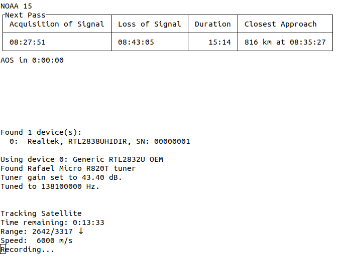

# APTbot

_an all-in-one satellite recorder_

 

This is a cli program to automatically record, decode, and transfer NOAA APT recordings.

### Features

-   CLI program to run on a headless host
-   Calculate passes, duration, closest approach
-   Automatically manage recording, transcoding, and decoding
-   Decode with both wxtoimg and noaa-apt
-   Limit the recording to when the satellite is within a range
-   Upload and display received images on a website
-   Update Kepler files from the internet
-   Python library for all these functions

### Install

1.  Run setup.sh

-   installs dependencies
-   installs pip packages
-   installs the RTL-SDR blog drivers for the RTL-SDR v3: <https://github.com/rtlsdrblog/rtl-sdr-blog>
-   Blacklists unnessesary kernel drivers

2.  Install Predict

-   <https://github.com/kd2bd/predict.git>

### Python Library

See [automated_noaa.py](noaa-capture/automated_noaa.py) as an example.

### Calibration

<https://medium.com/@rxseger/sdr-calibration-via-gsm-fcch-using-kalibrate-and-lte-cell-scanner-on-rtl-sdr-and-hackrf-193a7fb8a3eb>

### Notes

If you're having trouble, see the helpful websites in `links.txt`.

### Credits:

Uses the noaa-apt cli program: <https://github.com/martinber/noaa-apt.git>

Based on <https://github.com/DrPaulBrewer/rtlsdr-automated-wxsat-capture>
